# Introduction
This was a solo major project made solely by me.

# Stock Exchange(Full Stack App in Flutter)
This is the stock simulation game. In this game players trade stocks. And aim of the game is to earn highest amount of money.
Each player gets 10 cards, which represent for companies whether stocks price will go up or down, in next round.
Next Round stock price is determined by adding values of cards of each player and some reserved cards.

This project used knowledge of:-
  - Flutter
  - Dart
  - Advanced Slivers
  - Asynchronous Programming
  - Multi Player Handling
  - Transactions
  - Sembast (Inernal Memory Handling)
  - Firebase Cloud Firestore
  - Firebase authentication
  - Cloud Firestore Functions
  - Cloud Firestore Rules
  - Bar Chart
  - Images
  - Pie Chart
  - Line Chart
  - Dialogs
  - Math Equations (Using Flutter Tex)
  - Clean Coding
  
# Screenshots

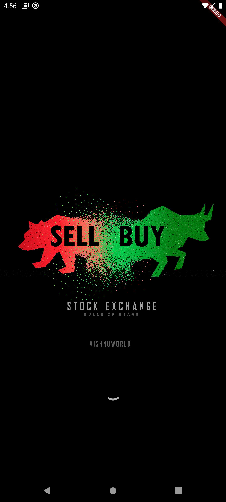  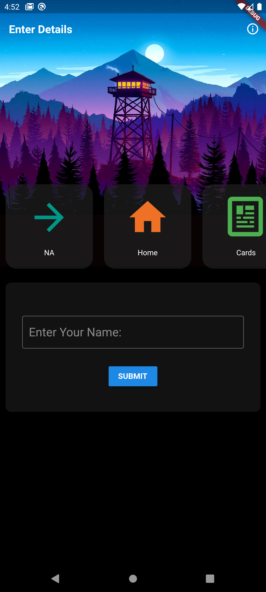 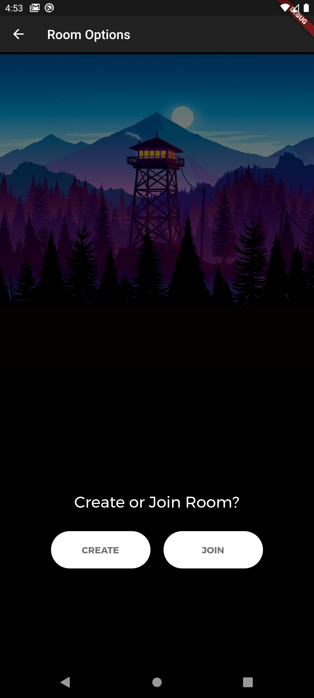
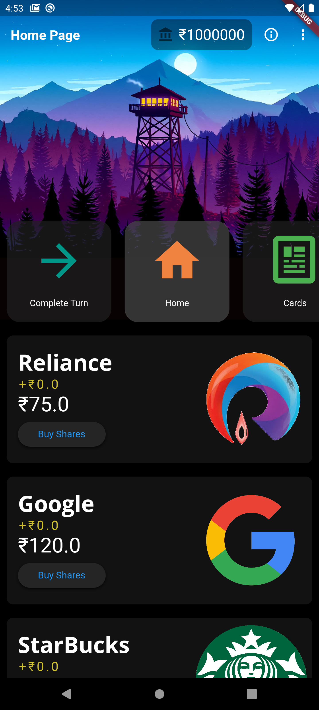  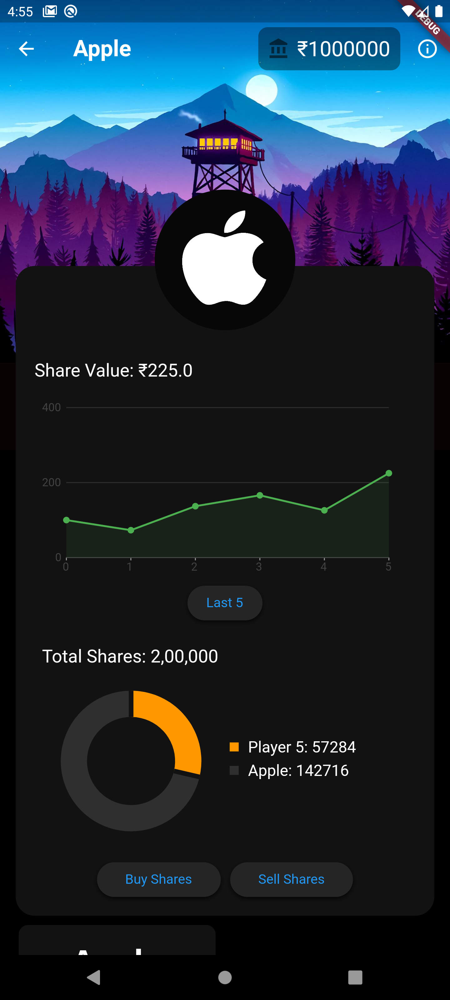 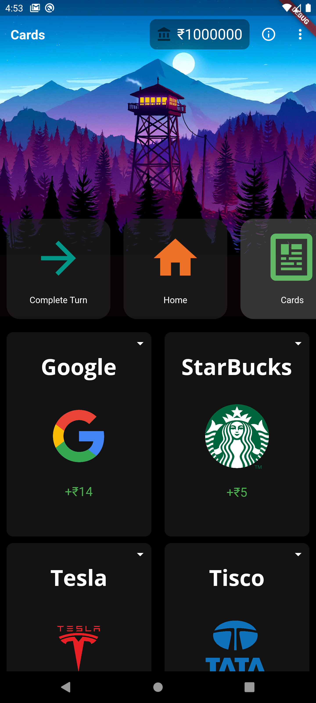
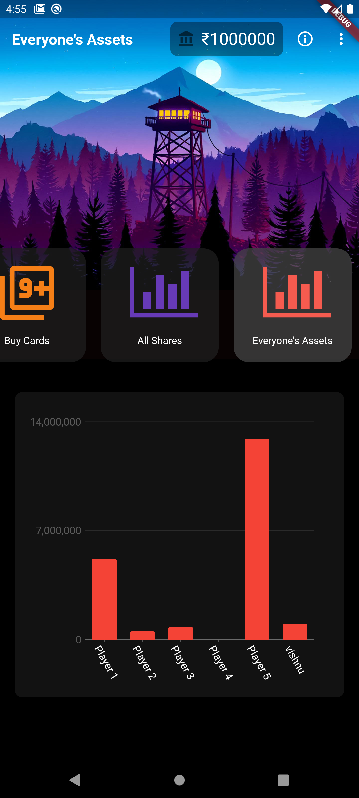  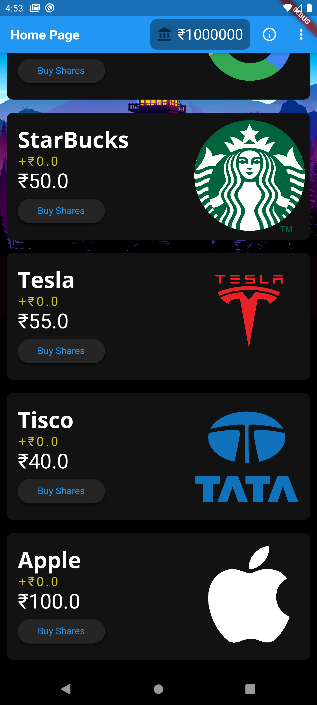 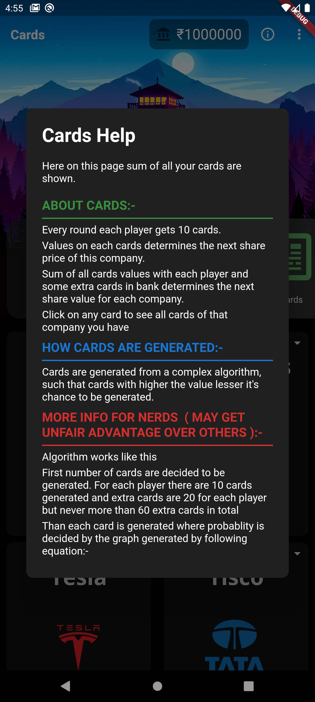
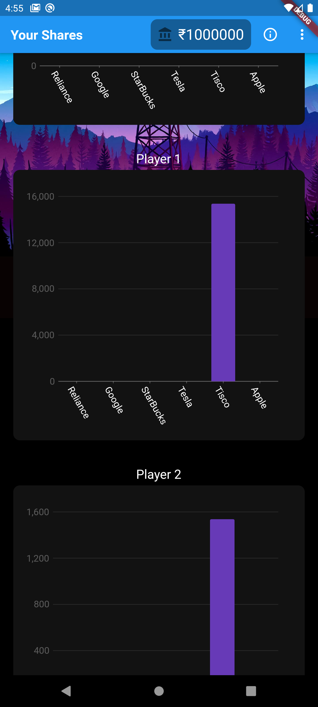  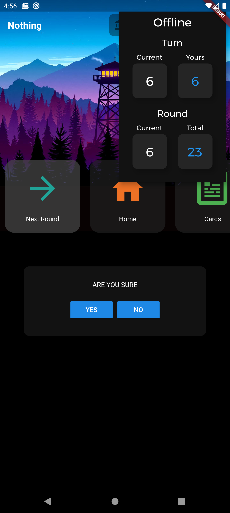 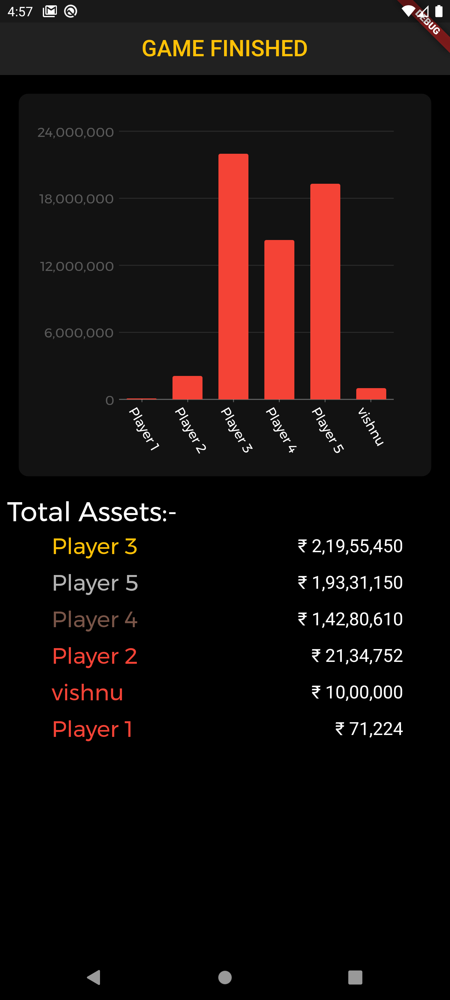
